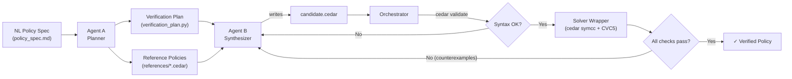

# AutoCedar — HITL Cedar Policy Synthesis

AutoCedar is a human-in-the-loop policy authoring agent for
[Cedar](https://www.cedarpolicy.com/) access control policies. It turns
natural-language policy intent into reviewed schema and property atoms, checks
those atoms with Cedar/CVC5 where possible, and uses the packaged v1 CEGIS
harness to verify and synthesize Cedar policies against formal bounds.

## Architecture



### Engine Layer (root)

| File                  | Role                                                                                                                                                      |
| --------------------- | --------------------------------------------------------------------------------------------------------------------------------------------------------- |
| `orchestrator.py`   | Evaluator entry point. Runs Gate 1 (syntax via `cedar validate`) then Gate 2 (verification plan checks via `cedar symcc`). Prints loss count.         |
| `solver_wrapper.py` | CVC5/Cedar CLI interface. Wraps three `cedar symcc` subcommands: `implies`, `always-denies`, `never-errors`. Returns `CheckResult` dataclasses. |
| `program.md`        | Agent instructions. Two-phase protocol for the AI coding agent.                                                                                           |

### Workspace Layer (`workspace/`)

| File                     | Role                                                   |
| ------------------------ | ------------------------------------------------------ |
| `schema.cedarschema`   | Cedar schema — entity types, attributes, and actions. |
| `policy_spec.md`       | Natural language access control requirements.          |
| `verification_plan.py` | Formal check definitions (generated by Agent A).       |
| `policy_store.cedar`   | Pre-existing organizational policies.                  |
| `references/*.cedar`   | Ceiling/reference policies for `implies` checks.     |
| `candidate.cedar`      | **Agent output** — the policy under synthesis.  |

### Three Verification Check Types

| Check              | `cedar symcc` subcommand                                | What it proves                                                |
| ------------------ | --------------------------------------------------------- | ------------------------------------------------------------- |
| **Safety**   | `implies --policies1 <candidate> --policies2 <ceiling>` | Candidate ≤ ceiling — never permits more than the reference |
| **Liveness** | `always-denies --policies <candidate>`                  | Policy does NOT trivially deny everything (inverted result)   |
| **Sanity**   | `never-errors --policies <candidate>`                   | No runtime type errors for any possible input                 |

### Entities vs. Domains

In Cedar, **entities** (`entities.json`) define concrete instances for runtime authorization (`cedar authorize`). This engine operates at the **symbolic/type level** using `cedar symcc`, which reasons over all possible inputs — so no `entities.json` is needed.

For bounding string values (e.g., valid departments), `@domain` annotations in the schema give the SMT solver a finite model, serving a similar conceptual role to entities but at the type-constraint level.

---

## Full Workflow

### Phase 0: Setup (Human)

1. **Write the schema** → `workspace/schema.cedarschema`

   - Define entity types, attributes, and actions
   - Optionally add `@domain` annotations to bound string values for the solver
2. **Write the policy spec** → `workspace/policy_spec.md`

   - Natural language rules (safety, liveness, etc.)
3. **Optionally provide existing policies** → `workspace/policy_store.cedar`

### Phase 1: Verification Planning (Agent A — one-time)

Agent A reads the spec + schema and produces the formal test harness:

- `verification_plan.py` — list of check descriptors (`implies`, `always-denies-liveness`, `never-errors`)
- `references/*.cedar` — ceiling policies encoding the maximum permissible scope

🔴 **Human review checkpoint** — verify the plan + references before synthesis.

### Phase 2: Synthesis Loop (Agent B — iterative)

```
                    ┌──────────────────────────────────┐
                    │                                  │
                    ▼                                  │
            ┌──────────────┐                           │
            │   Agent B    │                           │
            │ reads spec,  │                           │
            │ schema, and  │                           │
            │ prior errors │                           │
            └──────┬───────┘                           │
                   │ writes                            │
                   ▼                                   │
         candidate.cedar                               │
                   │                                   │
                   ▼                                   │
  ┌────────────────────────────────┐                   │
  │        ORCHESTRATOR.PY         │                   │
  │                                │                   │
  │  Gate 1: cedar validate        │                   │
  │    → syntax/type errors?       │                   │
  │                                │                   │
  │  Gate 2: cedar symcc + CVC5    │                   │
  │    → implies / always-denies   │                   │
  │      / never-errors            │                   │
  └────────────┬───────────────────┘                   │
               │                                       │
               ▼                                       │
        ┌─────────────┐      Yes                       │
        │ loss == 0 ? │──────────▶ ✅ VERIFIED          │
        └──────┬──────┘                                │
               │ No                                    │
               ▼                                       │
      Counterexamples returned                         │
      to Agent B for fixing                            │
               │                                       │
               └───────────────────────────────────────┘
                    (max 20 iterations)
```

### Example Iteration Trace

**Iteration 1** — Agent writes a naive policy:

```cedar
permit (principal, action == Action::"delete", resource);
```

**Result:** `loss: 1` — implies check fails.

```
COUNTEREXAMPLE: principal.department = "HR", resource.is_locked = false → ALLOW
```

**Iteration 2** — Agent adds department constraint:

```cedar
permit (principal, action == Action::"delete", resource)
when { principal.department == "Engineering" };
```

**Result:** `loss: 1` — still fails.

```
COUNTEREXAMPLE: resource.is_locked = true → ALLOW
```

**Iteration 3** — Agent adds lock guard:

```cedar
permit (principal, action == Action::"delete", resource)
when { principal.department == "Engineering" && !resource.is_locked };
```

**Result:** `loss: 0` — **all checks pass ✓**. Policy is formally verified.

---

## Install

From PyPI:

```bash
uv tool install autocedar
autocedar
```

One-shot without installing:

```bash
uvx autocedar
```

From a checkout:

```bash
uv run autocedar
```

The runtime package installs the Python agent/library and the `autocedar`
console script. Verification also needs the Cedar CLI and CVC5 solver on the
machine.

## External Dependencies

- **Python 3.11+**
- **Cedar CLI v4.10+**: `cargo install cedar-policy-cli`
- **CVC5 SMT solver**: default path `~/.local/bin/cvc5`, or set `$CVC5`

AutoCedar looks for:

- `$CEDAR`, defaulting to `~/.cargo/bin/cedar`
- `$CVC5`, defaulting to `~/.local/bin/cvc5`

If those binaries live elsewhere, set them in your shell or `.env`.

Check the verifier setup before running policy verification:

```bash
cedar --version
cedar symcc --help
cvc5 --version
```

If `cedar symcc --help` does not work, the installed Cedar binary cannot run
AutoCedar's symbolic verification path. Install a Cedar CLI build that includes
the `symcc` subcommand, or use the Docker image below.

## API Keys And `.env`

AutoCedar uses Anthropic models for the conversational TUI, schema
atomization, property atomization, and optional harness translation. The key is
read from `ANTHROPIC_API_KEY`.

You can export it:

```bash
export ANTHROPIC_API_KEY=sk-ant-...
autocedar
```

Or create a `.env` file in the directory where you run AutoCedar:

```dotenv
ANTHROPIC_API_KEY=sk-ant-...
AUTOCEDAR_MODEL=claude-opus-4-7
AUTOCEDAR_EFFORT=high
CEDAR=/usr/local/bin/cedar
CVC5=/usr/bin/cvc5
```

At startup, `autocedar` loads the nearest `.env` from the current directory or
one of its parents. Existing shell environment variables are not overridden.
For a normal project, the path is simply:

```text
your-policy-project/.env
```

The interactive agent can also configure the current session from inside the
TUI:

```text
/settings
/model claude-opus-4-7
/effort low|medium|high|max
/apikey
/apikey clear
```

`/apikey` prompts for the key and redacts it in the transcript. `/apikey
sk-ant-...` also works for one-line setup. In-agent settings affect the current
process; put `ANTHROPIC_API_KEY`, `AUTOCEDAR_MODEL`, and `AUTOCEDAR_EFFORT` in
`.env` when you want them to persist across launches.

## Docker

The Docker image is the lowest-friction runtime because it bundles the Python
package, Cedar CLI, and CVC5:

```bash
docker build -t autocedar .
docker run --rm -it \
  -e ANTHROPIC_API_KEY="$ANTHROPIC_API_KEY" \
  -v "$PWD:/work" \
  -w /work \
  autocedar
```

Tagged releases publish the same image to GitHub Container Registry:

```bash
docker run --rm -it \
  -e ANTHROPIC_API_KEY="$ANTHROPIC_API_KEY" \
  -v "$PWD:/work" \
  -w /work \
  ghcr.io/neselab/autocedar:latest
```

Docker users can either pass the key as `-e ANTHROPIC_API_KEY=...` or mount a
project directory containing `.env`; AutoCedar will load that mounted `.env`
from the container working directory.

## CLI

The runtime package exposes an `autocedar` console script:

```bash
autocedar
autocedar verify workspace
autocedar synthesize cedarbench/scenarios/realworld/emergency_break_glass \
  --no-review --max-iters 20
autocedar author path/to/spec.md --out ./autocedar-runs
```

With no arguments, `autocedar` opens the Textual-based interactive agent
shell. Talk to it in normal language: "verify the workspace", "save this as
policy.md", "author this with schema workspace/schema.cedarschema", or "start
a policy draft". Normal language stays conversational until drafting is
explicitly approved; policy-like prose opens a "start drafting and add this?"
gate instead of silently mutating the draft. Slash commands and explicit
subcommands remain as shortcuts for repeatable runs. Before running authoring,
verification, synthesis, saving, clearing, or starting draft capture, the TUI
summarizes the inferred action and waits for "yes" / "no". The conversational
layer can answer questions about the current TUI state, while `author` still
runs with clean authoring inputs: the saved prose spec, optional schema, and
HITL review decisions. `verify` and `synthesize` wrap the v1 CEGIS harness.
The CLI/TUI authoring path uses LLM-backed Stage 1 schema atomization and Stage
2 property atomization. The final Stage 3 synthesis hook remains injectable in
the library authoring pipeline; the explicit `synthesize` command wraps the v1
CEGIS harness directly.

### Interactive Agent Usage

Start the agent:

```bash
autocedar
```

Inside the TUI, normal language is the primary interface:

```text
start a policy draft
Doctors can read records for patients on their care team.
Managers can approve access only for records in their department.
show the draft
save this as clinical.md
author this with schema workspace/schema.cedarschema
verify the workspace
synthesize emergency_break_glass no review max iters 7
```

The agent does not silently mutate the draft. Policy-looking prose starts a
draft-capture confirmation unless drafting is already active. Operational
actions such as authoring, verification, synthesis, clearing, and saving also
show a yes/no confirmation before execution.

Slash shortcuts are available for repeatable control:

| Command | Purpose |
| --- | --- |
| `/settings` | Show selected model, effort, and API-key status. |
| `/model MODEL` | Set the default model for chat, authoring atomization, and default TUI synthesis phases. |
| `/effort low\|medium\|high\|max` | Set adaptive thinking effort for chat/authoring calls that support it. |
| `/apikey` | Prompt for `ANTHROPIC_API_KEY`; the transcript redacts the key. |
| `/apikey KEY` | Set `ANTHROPIC_API_KEY` for the current process. |
| `/apikey clear` | Remove the key from the current process. |
| `/draft` | Show the current prose draft. |
| `/save [PATH]` | Save the draft, defaulting to `autocedar-spec.md`. |
| `/new` | Clear the draft and leave drafting mode. |
| `/author SPEC --out DIR [--schema PATH] [--model MODEL] [--effort high]` | Run HITL authoring from a spec file. |
| `/verify [WORKSPACE]` | Verify an existing workspace, defaulting to `workspace`. |
| `/synthesize SCENARIO... [--out DIR] [--max-iters N] [--no-review]` | Run the v1 CEGIS harness on one or more scenarios. |
| `/clear` | Clear the transcript. |
| `/quit` | Exit. |

During HITL atom review, the prompt accepts one-line review commands:

| Review key | Meaning |
| --- | --- |
| `A` | Approve the proposed schema/property atom. |
| `R reason` | Reject the atom and record the reason. |
| `E field=value` | Edit a field on the current atom. |
| `Q question` | Record a question in the review log. |
| `S` | Show the Cedar/schema declaration for the atom. |
| `V` | Show patch notes when available. |

### Non-Interactive Commands

Use explicit subcommands for scripts and repeatable experiments:

```bash
autocedar author policy_spec.md \
  --out ./autocedar-runs \
  --schema workspace/schema.cedarschema \
  --model claude-opus-4-7 \
  --effort high

autocedar verify workspace

autocedar synthesize cedarbench/scenarios/realworld/emergency_break_glass \
  --no-review \
  --max-iters 20 \
  --phase1-model claude-opus-4-7 \
  --phase2-model claude-sonnet-4-20250514
```

### Output Files

Authoring writes session artifacts under the `--out` directory, usually
`autocedar-runs/<session-id>/`. The important files are:

| File | Meaning |
| --- | --- |
| `schema.cedarschema` | Composed or supplied Cedar schema. |
| `policy_spec.md` | Saved prose requirements. |
| `verification_plan.py` | Compiled checks from approved property atoms. |
| `references/*.cedar` | Human-reviewed floor/ceiling reference policies. |
| `candidate.cedar` | Synthesized candidate, when the synthesis hook produces one. |
| `corpus.jsonl` | Attribution, review decisions, symbolic logs, and iteration records. |

### Troubleshooting

| Symptom | Fix |
| --- | --- |
| Chat says no API key is loaded | Use `/apikey` in the TUI, export `ANTHROPIC_API_KEY`, or create `.env` in the directory where you launch `autocedar`. |
| API key works in shell but not TUI | Start `autocedar` from the project directory containing `.env`, or export the key before launch. |
| Verification says Cedar is missing | Set `CEDAR=/path/to/cedar` or install the Cedar CLI. |
| Verification says CVC5 is missing | Set `CVC5=/path/to/cvc5` or install CVC5. |
| `cedar symcc` is unknown | Install a Cedar CLI build with `symcc`, or use the Docker image. |
| Normal prose starts a confirmation | That is intentional. AutoCedar only begins draft capture after you approve it. |

For packaging, runtime code lives under `autocedar/`. The packaged v1
harness import surface is `autocedar.harness`; the root-level scripts
remain for backwards-compatible local workflows.

## Distribution

AutoCedar is distributed as a lean Python runtime package. CedarBench and the
larger research datasets are intentionally not included in the wheel; keep
them as repository or release artifacts for benchmark and paper reproduction.

Release builds are produced with:

```bash
uv build
uvx twine check dist/*
```

The release workflow template lives at `docs/release-workflow.yml`. Install it
as `.github/workflows/release.yml` using a GitHub token with `workflow` scope,
then pushing a `vX.Y.Z` tag builds the Python distributions, publishes to PyPI
through trusted publishing, and publishes the Docker image to GHCR.

## The reference policies *are* the security contract

In a real deployment, the reference policies (ceilings + floors) are the **formal spec** — they encode what the organization *intends* to allow. That's precisely the kind of thing a security team would sign off on, just like they review IAM policy boundaries today. The difference is these are *machine-verifiable*, not just documented in a wiki somewhere.

## The NL translation layer is a natural extension

And your instinct about the NL layer is spot on — it would slot in cleanly:

```
Security Admin (NL)
     ↕  ← LLM translation layer
Reference Policies (Cedar)
     ↓
Verification Engine (SMT)
     ↕  ← counterexample feedback
Agent B (policy synthesis)
```

The translation works in both directions:

1. **Ceiling → NL**: "This reference policy says: *View access is allowed only when the user is a Clinical Researcher with clearance above 3, the document is not Highly Restricted, the project is Active, and either the departments match or the user is a Global Auditor.*"
2. **Admin feedback → Updated ceiling**: Admin says "Actually, I want clearance level 5 for confidential documents specifically" → LLM updates the ceiling policy → engine re-verifies the candidate.
3. **Counterexample → NL**: Instead of showing raw entity graphs, translate them: *"A user in HR with clearance 3 was able to edit an Active project document — is this intended?"*

This closes the loop on the **Verifiable Synthesis Paradox** from our research. The paradox was: LLMs generate convincing explanations but incorrect policies. This architecture inverts that:

- The **LLM** writes the policy (where it's unreliable) → but the **SMT solver** catches errors
- The **LLM** translates formal specs to NL (where it's reliable) → so humans can audit the *ground truth*
- The security admin never needs to read Cedar — they review NL summaries of *formally verified* specs

The LLM is used where it's strong (NL ↔ NL translation, code generation with feedback) and the formal methods handle what it's weak at (correctness guarantees). That's a much cleaner division of labor than either pure LLM synthesis or pure manual policy writing.
