# AutoCedar — HITL Cedar Policy Synthesis

AutoCedar is a human-in-the-loop policy authoring agent for
[Cedar](https://www.cedarpolicy.com/) access control policies. It turns
natural-language policy intent into reviewed schema and property atoms, checks
those atoms with Cedar/CVC5 where possible, and uses the packaged v1 CEGIS
harness to verify and synthesize Cedar policies against formal bounds.

## Start Here

You do **not** need to clone this repository to use AutoCedar. The normal path
is the published Python package.

### Option A: Install From PyPI

Use this if you just want to run the AutoCedar agent. This installs a persistent
`autocedar` command on your PATH.

1. Install `uv` if you do not have it:

   ```bash
   curl -LsSf https://astral.sh/uv/install.sh | sh
   ```

   Restart your terminal after installing `uv`.

2. Install AutoCedar:

   ```bash
   uv tool install autocedar
   autocedar --version
   ```

   If your shell cannot find `autocedar`, restart the terminal. `uv` will also
   print the tool-bin directory it added to PATH.

   You can also install with `pip`, but only when that `pip` belongs to
   Python 3.11 or newer:

   ```bash
   python3.11 -m pip install --upgrade autocedar
   # or, if python3 is already 3.11+
   python3 -m pip install --upgrade autocedar
   autocedar --version
   ```

   If `pip install autocedar` says `No matching distribution found`, check
   `python3 --version`. AutoCedar requires Python 3.11+, and older Python
   interpreters will not see compatible PyPI releases.

3. Sign in to Codex for model-backed authoring:

   ```bash
   codex login
   autocedar doctor
   ```

   AutoCedar uses local Codex OAuth by default and reads the same
   `~/.codex/auth.json` cache used by Codex. No `OPENAI_API_KEY` is required.

   Anthropic is still available as an explicit opt-in provider. If you want
   that path, run:

   ```bash
   autocedar apikey
   ```

   Paste the Anthropic key when prompted. AutoCedar writes it to your user config
   (`~/.config/autocedar/.env` by default), redacts it in the terminal output,
   validates it with Anthropic before saving, and uses it immediately and on
   later launches.
   You can also run `autocedar apikey sk-ant-...` if you prefer a one-line
   command. Do not share or commit your API key.

4. Install/check the local verifier tools:

   ```bash
   autocedar setup --yes
   autocedar doctor
   ```

   `setup` installs or prints install steps for Cedar CLI and CVC5. `doctor`
   verifies the exact toolchain AutoCedar will use.

5. Start AutoCedar:

   ```bash
   autocedar
   ```

Already tried AutoCedar before? Use one of these update paths:

```bash
# Persistent install.
uv tool upgrade autocedar

# If you want to upgrade every installed uv tool.
uv tool upgrade --all

# One-off latest run without installing/upgrading the persistent command.
uvx --refresh --from autocedar@latest autocedar
```

Check which version you are running:

```bash
# Persistent install.
autocedar --version

# One-off latest package.
uvx --refresh --from autocedar@latest autocedar --version

# Repo-local development checkout.
uv run autocedar --version
```

`uvx` and `uv tool install` are different modes. `uvx --refresh --from
autocedar@latest autocedar` is a one-off latest run; it does not register
AutoCedar as a persistent tool. `uv tool list` only shows tools installed with
`uv tool install autocedar`, so AutoCedar not appearing there is expected if you
use the `uvx` path. For normal use, prefer `uv tool install autocedar`, then run
`autocedar`.

### Option B: Local From The Repo

Use this only for development, modifying AutoCedar itself, running tests, or
working directly with repo-local examples/datasets.

1. Clone the repo:

   ```bash
   git clone https://github.com/neselab/cedar-synthesis-engine.git
   cd cedar-synthesis-engine
   ```

2. Install the Python environment and sign in to Codex:

   ```bash
   uv sync
   codex login
   uv run autocedar doctor
   ```

   AutoCedar uses Codex OAuth by default. Anthropic is optional and explicit:
   use `AUTOCEDAR_PROVIDER=anthropic` or `/provider anthropic`, then run
   `uv run autocedar apikey` only if you intentionally want the Anthropic path.

3. Install/check the verifier tools:

   ```bash
   uv run autocedar setup --yes
   uv run autocedar doctor
   ```

   If setup says `Cargo is not installed`, install Rust first:

   ```bash
   curl --proto '=https' --tlsv1.2 -sSf https://sh.rustup.rs | sh
   ```

   If you prefer manual installation, these are the required checks:

   ```bash
   cargo install cedar-policy-cli --locked --version 4.10.0 --features analyze --force
   cedar --version
   cedar symcc --help | grep principal-type
   cvc5 --version
   ```

   If CVC5 lives outside your shell `PATH`, put its path in `.env`:

   ```dotenv
   CVC5=/path/to/cvc5
   ```

   On Ubuntu/Debian, that usually looks like:

   ```bash
   sudo apt-get update
   sudo apt-get install -y cvc5
   echo "CVC5=$(command -v cvc5)" >> .env
   ```

   On macOS with Homebrew, that usually looks like:

   ```bash
   brew install cvc5
   echo "CVC5=$(which cvc5)" >> .env
   ```

4. Run AutoCedar:

   ```bash
   uv run autocedar
   ```

`autocedar setup` installs or prints the missing verifier-tool install steps.
`autocedar doctor` checks the exact Cedar, SymCC, CVC5, and model auth state
AutoCedar will use. Fix any `FAIL` lines before authoring. After that, you
should see the AutoCedar interactive terminal UI.

### Option C: Docker

Docker is optional. Use it when you specifically want a containerized runtime
with Cedar/CVC5 already bundled.

Without cloning the repo:

```bash
docker run --rm -it \
  --env-file .env \
  -v "$HOME/.codex:/root/.codex:ro" \
  -v "$PWD:/work" \
  -w /work \
  ghcr.io/neselab/autocedar:latest
```

From a cloned repo, the helper script builds/runs the image and preflights
`autocedar doctor`:

```bash
./scripts/docker-autocedar
```

If Docker on Linux requires `sudo`, prefer the PyPI/local setup above. Running
`sudo docker` with `-v "$PWD:/work"` can leave root-owned files in your working
directory.

The Docker image pins Cedar CLI 4.10.0 with SymCC `analyze` enabled and installs
CVC5 in the image. It should not depend on your host machine's Cedar or CVC5.

### First Things To Type

Once the TUI opens, try:

```text
/settings
/models
/model gpt-5.5
/effort high
start a policy draft
Doctors can read records for patients on their care team.
show the draft
save this as clinical.md
```

When you are ready to run authoring:

```text
author this
```

If you already have a Cedar schema, use `author this with schema
workspace/schema.cedarschema` instead.

AutoCedar will ask for confirmation before executing actions and will pause for
human review when it proposes schema/property atoms.

### What Each Setup File Does

| File | What you put there |
| --- | --- |
| `.env` | Your local API key and optional runtime settings. Do not commit it. |
| `.env.example` | Template showing supported environment variables. Safe to commit. |
| `workspace/schema.cedarschema` | Optional existing Cedar schema for authoring/verification. |
| `workspace/candidate.cedar` | Existing candidate policy for `verify workspace`. |
| `workspace/verification_plan.py` | Existing formal checks for `verify workspace`. |

## Architecture

```mermaid
graph LR
    A["User in autocedar TUI<br/>or autocedar author"] --> B["Policy spec<br/>plain English"]
    B --> B0["Stage 0<br/>source DAG + local context packets"]
    B0 --> C{"Schema supplied?"}
    C -- "No" --> D["Stage 1<br/>LLM proposes schema atoms from bounded source packets"]
    D --> E["HITL review<br/>approve / reject / edit / question"]
    E --> F["Composed Cedar schema"]
    C -- "Yes" --> G["Use supplied schema<br/>skip Stage 1"]
    F --> H["Stage 2<br/>LLM proposes bounded local property bundles"]
    G --> H
    H --> I["Symbolic checks<br/>cedar symcc + CVC5"]
    I --> J["HITL review<br/>approve / reject / edit / question"]
    J --> R{"Rejected?"}
    R -- "No" --> K["Approved target updated"]
    R -- "Yes" --> RP["Model-planned repair<br/>current property / prior property / schema / skip / clarify"]
    RP --> H
    K --> IC["Incremental candidate check<br/>against approved atoms so far"]
    IC --> H
    K --> L["Final Stage 3 synthesis<br/>v1 CEGIS harness"]
    L --> M["candidate.cedar"]
    M --> N{"All checks pass?"}
    N -- "No, verifier feedback" --> L
    N -- "Yes" --> O["Verified policy"]
```



### Engine Layer

| File | Role |
| --- | --- |
| `autocedar/tui.py` | Interactive conversational terminal agent. This is what `autocedar` opens by default. |
| `autocedar/agent.py` | Structured terminal-agent control plane: model-produced `AgentAction`s, state snapshots, and planner validation. |
| `autocedar/cli.py` | Console entry point for `autocedar`, plus scriptable `author`, `verify`, and `synthesize` subcommands. |
| `autocedar/pipeline.py` | End-to-end authoring pipeline: schema atoms, property atoms, review, harness compile, Stage 3 synthesis hook. |
| `autocedar/llm.py` | Provider-backed structured LLM calls for schema/property atomization and repair. |
| `autocedar/source_doc.py` | Source-DAG and context-packet layer. It splits prose into source nodes, selects local context, tracks coverage, and writes source provenance. |
| `autocedar/schema_atomizer.py` | Stage 1 schema atom proposal, composition, and schema validation helpers. |
| `autocedar/property_atomizer.py` | Stage 2 property atom proposal from prose plus validated schema. |
| `autocedar/ui/terminal.py` | HITL review loop for schema and property atoms. |
| `autocedar/harness/` | Packaged v1 CEGIS harness: `eval_harness.py`, `orchestrator.py`, and `solver_wrapper.py`. |

### Workspace Layer (`workspace/`)

| File | Role |
| --- | --- |
| `policy_spec.md` | Natural-language access-control requirements. This is the main input. |
| `schema.cedarschema` | Optional existing Cedar schema. If omitted during authoring, AutoCedar proposes schema atoms and asks you to review them. |
| `verification_plan.py` | Formal check definitions compiled from approved property atoms, or an existing plan used by `verify workspace`. |
| `references/*.cedar` | Human-reviewed reference policies compiled from approved property atoms. |
| `policy_store.cedar` | Optional pre-existing organizational policies. |
| `candidate.cedar` | Synthesized or existing policy under verification. |

### Three Verification Check Types

| Check              | `cedar symcc` subcommand                                | What it proves                                                |
| ------------------ | --------------------------------------------------------- | ------------------------------------------------------------- |
| **Safety**   | `implies --policies1 <candidate> --policies2 <ceiling>` | Candidate ≤ ceiling — never permits more than the reference |
| **Liveness** | `always-denies --policies <candidate>`                  | Policy does NOT trivially deny everything (inverted result)   |
| **Sanity**   | `never-errors --policies <candidate>`                   | No runtime type errors for any possible input                 |

### Entities vs. Domains

In Cedar, **entities** (`entities.json`) define concrete instances for runtime authorization (`cedar authorize`). This engine operates at the **symbolic/type level** using `cedar symcc`, which reasons over all possible inputs — so no `entities.json` is needed.

For bounding string values (e.g., valid departments), `@domain` annotations in the schema give the SMT solver a finite model, serving a similar conceptual role to entities but at the type-constraint level.

---

## Full Workflow

The normal workflow is inside the CLI agent. You do not have to hand-write a
schema before authoring unless you already have one.

### Step 1: Start the agent

```bash
uv run autocedar
```

Inside the TUI, describe what you want in normal language. Plain conversation
stays conversational. Drafting and tool execution only start after explicit
confirmation.

### Step 2: Capture or load a policy spec

You can type a spec into the TUI:

```text
start a policy draft
Doctors can read records for patients on their care team.
Nurses can update vitals, but only during their shift.
show the draft
save this as clinical.md
```

Or you can start from an existing file:

```text
author clinical.md
```

### Step 3: Choose schema mode

There are two supported paths:

| Path | What happens |
| --- | --- |
| No schema supplied: `author clinical.md` | AutoCedar proposes Stage 1 schema atoms: entity types, attributes, actions, and type aliases. You approve, reject, edit, or question each atom. Approved atoms are composed into `schema.cedarschema`. |
| Existing schema supplied: `author clinical.md with schema workspace/schema.cedarschema` | AutoCedar skips Stage 1 schema atomization and uses your schema directly. |

If you need bounded string values for symbolic reasoning, mention that in the
spec or add/edit the schema during review with Cedar `@domain` annotations.

### Step 4: Review schema and property atoms

AutoCedar uses the same review controls for both schema intent and policy
intent:

| Review key | Meaning |
| --- | --- |
| `A` | Approve the proposed schema/property atom. |
| `R reason` | Reject it and record why. In authoring, rejected property atoms are sent back to the model for a replacement when repair is available. |
| `E field=value` | Edit the current atom. |
| `Q question` | Ask the model about the atom before deciding. |
| `S` | Show the Cedar/schema declaration for the atom. |
| `V` | Show patch notes when available. |

Common edit examples:

```text
E cedar_type=Bool
E optional=true
E field_name=isPublic
E principal_types=User,Admin
E resource_types=Document
E action=view
E constraint_type=floor
```

For example, if AutoCedar proposes a schema attribute as `String` but it should
be a boolean flag, use `E cedar_type=Bool`. AutoCedar re-presents the edited
atom before you approve it. If you edit a property atom, symbolic checks are
rerun after approval so stale verification results are not reused.

After the schema is established, AutoCedar asks the model for bounded local
Stage 2 property bundles from a source packet plus the current schema and
approved target. This cuts repeated model round trips without changing the
review contract: each returned property atom is still symbolically checked and
sent through HITL review one by one before it can enter the formal target. Each
source packet records the current source node, nearby clauses, related
definitions, approved atoms, and prior review history.

The approved atoms become the formal verification harness:

- `verification_plan.py` — check descriptors such as `implies`,
  `always-denies-liveness`, and `never-errors`
- `references/*.cedar` — reviewed ceiling/floor reference policies

If you reject a property atom, AutoCedar now asks the model for a structured
repair plan instead of guessing from keywords in your rejection text. The model
must choose one of these actions:

| Repair action | Meaning |
| --- | --- |
| `repair_current_property` | The proposed atom is the right intent slice, but its Cedar, direction, or scope needs repair. |
| `repair_prior_property` | The new atom is valid, but an earlier approved property is too narrow, too broad, or should be merged/revised. |
| `repair_schema` | The current schema cannot express the accepted intent, so AutoCedar proposes and reviews schema-repair atoms before continuing. |
| `reject_current` | The atom is not wanted intent and should be skipped. |
| `ask_user_clarification` | The source packet and review reason are not enough to decide safely. |

After each approved property atom, AutoCedar compiles the approved target so far
and runs an incremental candidate check. This is an early diagnostic pass: it
does not replace final Stage 3 synthesis, but it surfaces candidate/schema/atom
conflicts while the intent target is still being built.

### Step 5: Synthesize and verify

Once the approved atoms compile into a harness, Stage 3 runs the CEGIS loop:

```
                    ┌──────────────────────────────────┐
                    │                                  │
                    ▼                                  │
            ┌──────────────┐                           │
            │ Synthesizer  │                           │
            │ reads spec,  │                           │
            │ schema, and  │                           │
            │ prior errors │                           │
            └──────┬───────┘                           │
                   │ writes                            │
                   ▼                                   │
         candidate.cedar                               │
                   │                                   │
                   ▼                                   │
  ┌────────────────────────────────┐                   │
  │        ORCHESTRATOR.PY         │                   │
  │                                │                   │
  │  Gate 1: cedar validate        │                   │
  │    → syntax/type errors?       │                   │
  │                                │                   │
  │  Gate 2: cedar symcc + CVC5    │                   │
  │    → implies / always-denies   │                   │
  │      / never-errors            │                   │
  └────────────┬───────────────────┘                   │
               │                                       │
               ▼                                       │
        ┌─────────────┐      Yes                       │
        │ loss == 0 ? │──────────▶ ✅ VERIFIED          │
        └──────┬──────┘                                │
               │ No                                    │
               ▼                                       │
      Counterexamples returned                         │
      to the synthesizer for fixing                    │
               │                                       │
               └───────────────────────────────────────┘
                    (max 20 iterations)
```

### Example Iteration Trace

**Iteration 1** — Agent writes a naive policy:

```cedar
permit (principal, action == Action::"delete", resource);
```

**Result:** `loss: 1` — implies check fails.

```
COUNTEREXAMPLE: principal.department = "HR", resource.is_locked = false → ALLOW
```

**Iteration 2** — Agent adds department constraint:

```cedar
permit (principal, action == Action::"delete", resource)
when { principal.department == "Engineering" };
```

**Result:** `loss: 1` — still fails.

```
COUNTEREXAMPLE: resource.is_locked = true → ALLOW
```

**Iteration 3** — Agent adds lock guard:

```cedar
permit (principal, action == Action::"delete", resource)
when { principal.department == "Engineering" && !resource.is_locked };
```

**Result:** `loss: 0` — **all checks pass ✓**. Policy is formally verified.

---

## Detailed Setup Reference

AutoCedar is published on PyPI. For normal use, install the persistent command:

```bash
uv tool install autocedar
autocedar
```

`pip` also works when it is tied to Python 3.11+:

```bash
python3.11 -m pip install --upgrade autocedar
# or, if python3 is already 3.11+
python3 -m pip install --upgrade autocedar
autocedar --version
```

If plain `pip install autocedar` cannot find a matching distribution, that
usually means the `pip` command is using Python 3.10 or older. Use a Python
3.11+ interpreter explicitly, or use the `uv tool install autocedar` path above.

To upgrade a persistent install:

```bash
uv tool upgrade autocedar
autocedar --version
```

For repo-local development, use:

```bash
uv run autocedar
```

The runtime package installs the Python agent/library and the `autocedar`
console script. Verification also needs the Cedar CLI and CVC5 solver. Use the
guided setup path:

```bash
autocedar apikey
autocedar setup --yes
autocedar doctor
autocedar --version
autocedar
```

If setup cannot safely install a system dependency on your platform, it prints
the exact blocked prerequisite. Docker/GHCR remains the fully bundled path.

For a one-off latest run without installing a persistent command:

```bash
uvx --refresh --from autocedar@latest autocedar
```

### External Dependencies

- **Python 3.11+**
- **Cedar CLI v4.10+ with SymCC analysis enabled**:
  `cargo install cedar-policy-cli --locked --version 4.10.0 --features analyze`
- **CVC5 SMT solver**: AutoCedar first uses `$CVC5`, then `cvc5` on `$PATH`,
  then falls back to `~/.local/bin/cvc5`

AutoCedar looks for:

- `$CEDAR`, defaulting to `~/.cargo/bin/cedar`
- `$CVC5`, defaulting to `cvc5` on `$PATH`, then `~/.local/bin/cvc5`

If those binaries live elsewhere, set them in your shell or `.env`.

Check the verifier setup before running policy verification:

```bash
uv run autocedar setup
uv run autocedar doctor
cedar --version
cedar symcc --help | grep principal-type
cvc5 --version
```

If `cedar symcc --help` says the CLI was built without `analyze`, or if
`grep principal-type` prints nothing, the installed Cedar binary cannot run
AutoCedar's symbolic verification path. Reinstall with:

```bash
cargo install cedar-policy-cli --locked --version 4.10.0 --features analyze --force
```

### LLM Providers And Local Config

AutoCedar supports two live model providers:

- **OpenAI Codex** by local Codex OAuth. This is the default provider. It reuses the login cache created by
  `codex login` and defaults to `gpt-5.5`.
- **Anthropic** by API key. This is explicit opt-in via
  `AUTOCEDAR_PROVIDER=anthropic` or `/provider anthropic`.

#### Anthropic API Key

The easiest explicit Anthropic path is the CLI helper:

```bash
uv run autocedar apikey
```

It prompts for the key with hidden input, creates or updates the user-level
AutoCedar config, and sets `ANTHROPIC_API_KEY` for that process. By default the
key is stored here:

```text
~/.config/autocedar/.env
```

Project `.env` files still work and override the user config when present. To
write a specific project file:

```bash
uv run autocedar apikey --env ./policy-project/.env
```

To remove the persisted key:

```bash
uv run autocedar apikey clear
```

You can also export it:

```bash
export ANTHROPIC_API_KEY=sk-ant-...
autocedar
```

Or create a `.env` file in the directory where you run AutoCedar:

```dotenv
AUTOCEDAR_PROVIDER=codex
AUTOCEDAR_CODEX_MODEL=gpt-5.5
AUTOCEDAR_EFFORT=high
CEDAR=/usr/local/bin/cedar
CVC5=/usr/bin/cvc5
```

At startup, `autocedar` loads the nearest `.env` from the current directory or
one of its parents. Existing shell environment variables are not overridden.
For a normal project, the path is simply:

```text
your-policy-project/.env
```

#### OpenAI Codex OAuth

To use the default Codex provider, sign in once with the Codex CLI:

```bash
codex login
```

Codex stores the local login under `~/.codex/auth.json` by default. Treat that
file like a password; it contains OAuth tokens. AutoCedar reads that cache,
refreshes it when needed, calls the Codex backend directly, and discovers the
models visible to that token. No `OPENAI_API_KEY` is required for this path.

Inside AutoCedar, these commands show or adjust the default path:

```text
/provider codex
/models
/model gpt-5.5
/effort high
```

`/models` lists the models visible to your Codex OAuth token and shows each
model's supported reasoning levels, default reasoning level, context window,
speed/service tiers, and verbosity support. AutoCedar keeps the UI spelling
`max`; when the selected provider is Codex, `/effort max` sends Codex's
token-visible `xhigh` reasoning level.

To switch to Anthropic explicitly:

```text
/provider anthropic
```

If your Codex auth file lives somewhere else, set one of:

```bash
export CODEX_HOME=/path/to/codex-home
export AUTOCEDAR_CODEX_AUTH_PATH=/path/to/auth.json
```

#### TUI Settings

The interactive agent can configure the current session from inside the TUI:

```text
/settings
/provider anthropic|codex
/models
/model gpt-5.5
/effort low|medium|high|max
/apikey
/apikey clear
```

`/apikey` prompts for the Anthropic key, redacts it in the transcript, and validates it
with Anthropic before saving. `/apikey sk-ant-...` also works for one-line
setup. Rejected keys are not persisted. Valid keys save to the same user-level
AutoCedar config, so the key persists across new `uvx` sessions and package
upgrades. `/provider codex` uses the Codex OAuth cache instead of the Anthropic
API key; `/models` shows the token-visible Codex models, reasoning levels,
context windows, and speed/service tiers.

### Docker

Docker is an optional containerized runtime. It is useful for reproducibility,
but local install is usually simpler on Linux because Docker often requires
extra daemon permissions.

```bash
./scripts/docker-autocedar
```

The script builds the image, uses `.env`, and mounts the current repo.

Manual equivalent:

```bash
docker build -t autocedar .
docker run --rm -it \
  --env-file .env \
  -v "$HOME/.codex:/root/.codex:ro" \
  -v "$PWD:/work" \
  -w /work \
  autocedar
```

If Docker reports `invalid reference format`, use the one-line form below.
That error is usually caused by hidden Unicode spaces or broken line
continuations in a copied multi-line command:

```bash
docker run --rm -it --env-file .env -v "$HOME/.codex:/root/.codex:ro" -v "$PWD:/work" -w /work autocedar
```

Tagged releases publish the same image to GitHub Container Registry:

```bash
docker run --rm -it \
  --env-file .env \
  -v "$HOME/.codex:/root/.codex:ro" \
  -v "$PWD:/work" \
  -w /work \
  ghcr.io/neselab/autocedar:latest
```

Docker users who want the default Codex provider should mount their Codex auth
cache into the container, for example `-v "$HOME/.codex:/root/.codex:ro"`.
If you explicitly switch to Anthropic, pass `-e ANTHROPIC_API_KEY=...` or mount
a project directory containing `.env`; AutoCedar will load that mounted `.env`
from the container working directory.

## How To Use AutoCedar

From this repo, prefix commands with `uv run`:

```bash
uv run autocedar
uv run autocedar verify workspace
uv run autocedar synthesize cedarbench/scenarios/realworld/emergency_break_glass \
  --no-review --max-iters 20
uv run autocedar author path/to/spec.md --out ./autocedar-runs
```

After package installation, drop the `uv run` prefix and use `autocedar`
directly.

With no arguments, `autocedar` opens the Textual-based interactive agent
shell. Talk to it in normal language: "verify the workspace", "save this as
policy.md", "author this", or "start a policy draft". Use "author this with
schema workspace/schema.cedarschema" only when you already have a schema.
Normal language stays conversational until drafting is
explicitly approved; policy-like prose opens a "start drafting and add this?"
gate instead of silently mutating the draft. Slash commands and explicit
subcommands remain as shortcuts for repeatable runs. Before running authoring,
verification, synthesis, saving, clearing, or starting draft capture, the TUI
summarizes the inferred action and waits for "yes" / "no". The conversational
layer can answer questions about the current TUI state, while `author` still
runs with clean authoring inputs: the saved prose spec, optional schema, and
HITL review decisions. `verify` and `synthesize` wrap the v1 CEGIS harness.
The CLI/TUI authoring path uses LLM-backed Stage 1 schema atomization and
one-at-a-time Stage 2 property atomization, then runs Stage 3 through the
packaged v1 CEGIS harness adapter. The Stage 3 hook remains injectable for
library users and tests; the explicit `synthesize` command also wraps the v1
CEGIS harness directly.

### Interactive Agent Usage

Start the agent:

```bash
uv run autocedar
```

Inside the TUI, normal language is the primary interface once Codex OAuth is
available through `codex login`, or once you explicitly switch to Anthropic and
configure an Anthropic key. The live planner maps
each message to one validated tool action; AutoCedar does not run a separate
local phrase router.

```text
start a policy draft
Doctors can read records for patients on their care team.
Managers can approve access only for records in their department.
show the draft
save this as clinical.md
author this
verify the workspace
synthesize emergency_break_glass no review max iters 7
```

If you already have a Cedar schema, say `author this with schema
workspace/schema.cedarschema` to skip schema atomization and use that schema.

The agent does not silently mutate the draft. Starting policy authoring only
turns on draft-capture mode; it does not add the sentence that started the mode
to the draft. After AutoCedar says policy authoring has started, paste the
natural-language requirements you want captured. Operational actions such as
authoring, verification, synthesis, clearing, and saving also show a yes/no
confirmation before execution.

Slash shortcuts are available for repeatable control:

| Command | Purpose |
| --- | --- |
| `/settings` | Show selected provider, model, effort, and auth status. |
| `/provider anthropic\|codex` | Switch between Anthropic API-key mode and local Codex OAuth mode. |
| `/models` | Show available models for the active provider. For Codex, this queries the token-backed Codex model endpoint and shows reasoning levels, context windows, and speed/service tiers. |
| `/model MODEL` | Set the default model for the agent planner, authoring atomization, and default TUI synthesis phases. |
| `/effort low\|medium\|high\|max` | Set adaptive thinking effort for planner/authoring calls that support it. |
| `/apikey` | Prompt for `ANTHROPIC_API_KEY`; save it to user config and redact it in the transcript. |
| `/apikey KEY` | Save `ANTHROPIC_API_KEY` to user config. |
| `/apikey clear` | Remove the key from user config and the current process. |
| `/draft` | Start draft capture when empty, otherwise show the current prose draft with line numbers. |
| `/draft edit LINE TEXT` | Replace one draft/spec line from inside the TUI. |
| `/draft delete LINE` | Delete one draft/spec line from inside the TUI. |
| `/draft insert LINE TEXT` | Insert a draft/spec line before `LINE`. |
| `/artifacts` | Show the latest authoring session, schema, and policy paths. |
| `/inspect [QUERY]` | Inspect the current workflow state, latest verification status, and key generated files. Optional `QUERY` searches those files too. |
| `/search [QUERY]` | Search the latest workflow/generated files, including schema, policy, eval logs, atom records, plans, and session text files. |
| `/schema [PATH]` | Show the latest generated Cedar schema, or a schema file you provide. |
| `/policy [PATH]` | Show the latest synthesized Cedar policy, or a policy file you provide. |
| `/copy last` | Copy the last assistant message. |
| `/copy transcript` | Copy the plain-text conversation transcript AutoCedar tracks. |
| `/copy session` | Copy the latest authoring session path to the system clipboard when supported. |
| `/copy schema [path]` | Copy the latest schema text, or use `/copy schema path` to copy its path. |
| `/copy policy [path]` | Copy the latest policy text, or use `/copy policy path` to copy its path. |
| `/export [DIR]` | Write the latest schema, policy, transcript, and artifact index to a normal folder, defaulting to `autocedar-export/`. |
| `/save [PATH]` | Save the draft, defaulting to `autocedar-spec.md`. |
| `/new` | Clear the draft and leave drafting mode. |
| `/author [SPEC] --out DIR [--schema PATH] [--model MODEL] [--effort high]` | Run HITL authoring from a spec file, or from the current draft when no spec is supplied. |
| `/verify [WORKSPACE]` | Verify an existing workspace, defaulting to `workspace`. |
| `/synthesize SCENARIO... [--out DIR] [--max-iters N] [--no-review]` | Run the v1 CEGIS harness on one or more scenarios. |
| `/clear` | Clear the transcript. |
| `/quit` | Exit. |

You can also say this in ordinary language, for example: `change line 2 to
Nurses can update vitals only during their shift`, `delete draft line 3`, or
`insert before line 2 Patients can view their own records`. The model planner
turns that into the same draft-edit action as the slash shortcuts.

During HITL atom review, the prompt accepts one-line review commands:

| Review key | Meaning |
| --- | --- |
| `A` | Approve the proposed schema/property atom. |
| `R reason` | Reject the atom and record the reason. During authoring, rejected property atoms are repaired and shown again when a repair model is available. |
| `E field=value` | Edit a field on the current atom. |
| `Q question` | Record a question in the review log. |
| `S` | Show the Cedar/schema declaration for the atom. |
| `V` | Show patch notes when available. |

Useful edits:

```text
E cedar_type=Bool
E optional=true
E principal_types=User,Admin
E resource_types=Document
E action=view
E reference_cedar=permit (...) when { ... };
```

After an edit, AutoCedar shows the atom again. Approve only when the corrected
schema/property intent matches what you mean.

If a property atom fails symbolic checks, prefer `R reason` when the atom is
conceptually wrong and `E field=value` when a specific field is wrong. A
rejected property atom is repaired by the model and shown again for review; it
is not silently approved.

### Non-Interactive Commands

Use explicit subcommands for scripts and repeatable experiments:

```bash
uv run autocedar author policy_spec.md \
  --out ./autocedar-runs \
  --schema workspace/schema.cedarschema \
  --model gpt-5.5 \
  --effort high

uv run autocedar verify workspace

uv run autocedar synthesize cedarbench/scenarios/realworld/emergency_break_glass \
  --no-review \
  --max-iters 20 \
  --phase1-model gpt-5.5 \
  --phase2-model gpt-5.5
```

### Output Files

Authoring writes session artifacts under the `--out` directory, usually
`autocedar-runs/<session-id>/`. The important files are:

| File | Meaning |
| --- | --- |
| `stage0/source_index.json` | Source nodes, line ranges, headings, and paragraph/list structure extracted from the input spec. |
| `stage0/context_packets/*.json` | Bounded schema/property context packets shown to the model for each atom proposal. |
| `stage0/intent_dag.json` | Source DAG plus links from source nodes to schema atoms, property atoms, and schema gaps. |
| `stage0/coverage_ledger.json` | Which source nodes are covered, still open, or marked non-authorization intent. |
| `stage1/final_schema.cedarschema` | Composed or supplied Cedar schema. |
| `stage1_5/schema_gaps.json` | Schema gaps selected by the structured repair planner during property review. |
| `stage1_5/schema_gap_repairs.json` | Schema atoms proposed/reviewed to repair those gaps. |
| `stage2/proposed_atoms.json` | Property atoms proposed during Stage 2. |
| `stage2/decisions.json` | HITL decisions, including rejected-property repair history. |
| `stage2/repair_plans.json` | Structured model repair plans for rejected property atoms. |
| `stage2/incremental_candidates.json` | Candidate-check results after each approved property atom. |
| `stage2/final_plan/verification_plan.py` | Compiled checks from approved property atoms. |
| `stage2/final_plan/references/*.cedar` | Human-reviewed floor/ceiling/disjointness reference policies. |
| `stage3/final_candidate.cedar` | Final synthesized candidate policy produced by Stage 3. |
| `harness_runs/scenario/candidate.cedar` | Final harness candidate and eval log from the packaged CEGIS run. |

### Troubleshooting

| Symptom | Fix |
| --- | --- |
| Chat says auth is not configured | Default path: run `codex login`, then `autocedar doctor`. Explicit Anthropic path: run `autocedar apikey`, use `/apikey` in the TUI, or export `ANTHROPIC_API_KEY`. |
| API key works in shell but not TUI | This applies only after `/provider anthropic`. Run `autocedar doctor` to confirm what AutoCedar sees. Shell env wins first; otherwise the saved AutoCedar user config key wins over a stale project `.env` key. |
| Cannot select/copy from the TUI | Textual full-screen apps can intercept mouse selection. Use `/export` for the most reliable path: it writes `schema.cedarschema`, `policy_store.cedar`, `transcript.txt`, and `artifacts.txt` to `autocedar-export/`. Clipboard shortcuts are also available with `/copy last`, `/copy transcript`, `/copy session`, `/copy schema path`, `/copy policy path`, `/copy schema`, or `/copy policy`. Some terminals allow mouse selection while holding Shift. |
| Verification says Cedar is missing | Set `CEDAR=/path/to/cedar` or install the Cedar CLI. |
| Verification says CVC5 is missing | Install CVC5, confirm `cvc5 --version` works, then set `CVC5=$(command -v cvc5)` in `.env` if needed. |
| `cedar symcc` is unknown or says it was built without `analyze` | Reinstall Cedar with `cargo install cedar-policy-cli --locked --version 4.10.0 --features analyze --force`, then confirm `cedar symcc --help \| grep principal-type` prints a line. |
| `uv run autocedar` says `Failed to spawn: autocedar` | The local virtualenv has stale console scripts. Run `uv sync --reinstall-package autocedar`, then retry `uv run autocedar`. |
| AutoCedar says `Permission denied: autocedar-runs/...` | Your repo or output directory is probably owned by `root` from a prior `sudo docker` or `sudo uv run`. From the repo root, run `sudo chown -R "$USER":"$USER" .` and `chmod -R u+rwX .`, then retry without `sudo`. |
| Docker says `permission denied while trying to connect to the docker API` | On Linux, your user cannot access `/var/run/docker.sock`. Prefer local setup, or fix Docker access with `sudo usermod -aG docker "$USER"`, then log out and back in, or run `newgrp docker`, then test with `docker ps`. Avoid `sudo docker` with a bind-mounted repo unless you are prepared to repair file ownership afterward. |
| Docker says `invalid reference format` | Run `./scripts/docker-autocedar` instead of pasting a long Docker command. This usually means the copied command contains hidden Unicode spaces, smart punctuation, or a missing trailing `\`. |
| Normal prose starts a confirmation | That is intentional. AutoCedar only begins draft capture after you approve it. |

For packaging, runtime code lives under `autocedar/`. The packaged v1
harness import surface is `autocedar.harness`; the root-level scripts
remain for backwards-compatible local workflows.

## Distribution

AutoCedar is distributed as a lean Python runtime package. CedarBench and the
larger research datasets are intentionally not included in the wheel; keep
them as repository or release artifacts for benchmark and paper reproduction.

Release builds are produced with:

```bash
uv build
uvx twine check dist/*
```

The release workflow template lives at `docs/release-workflow.yml`. Install it
as `.github/workflows/release.yml` using a GitHub token with `workflow` scope,
then pushing a `vX.Y.Z` tag builds the Python distributions, publishes to PyPI
through trusted publishing, and publishes the Docker image to GHCR.

## The reference policies *are* the security contract

In a real deployment, the reference policies (ceilings + floors) are the **formal spec** — they encode what the organization *intends* to allow. That's precisely the kind of thing a security team would sign off on, just like they review IAM policy boundaries today. The difference is these are *machine-verifiable*, not just documented in a wiki somewhere.

## The NL translation layer is a natural extension

And your instinct about the NL layer is spot on — it would slot in cleanly:

```
Security Admin (NL)
     ↕  ← LLM translation layer
Reference Policies (Cedar)
     ↓
Verification Engine (SMT)
     ↕  ← counterexample feedback
Synthesizer (policy generation)
```

The translation works in both directions:

1. **Ceiling → NL**: "This reference policy says: *View access is allowed only when the user is a Clinical Researcher with clearance above 3, the document is not Highly Restricted, the project is Active, and either the departments match or the user is a Global Auditor.*"
2. **Admin feedback → Updated ceiling**: Admin says "Actually, I want clearance level 5 for confidential documents specifically" → LLM updates the ceiling policy → engine re-verifies the candidate.
3. **Counterexample → NL**: Instead of showing raw entity graphs, translate them: *"A user in HR with clearance 3 was able to edit an Active project document — is this intended?"*

This closes the loop on the **Verifiable Synthesis Paradox** from our research. The paradox was: LLMs generate convincing explanations but incorrect policies. This architecture inverts that:

- The **LLM** writes the policy (where it's unreliable) → but the **SMT solver** catches errors
- The **LLM** translates formal specs to NL (where it's reliable) → so humans can audit the *ground truth*
- The security admin never needs to read Cedar — they review NL summaries of *formally verified* specs

The LLM is used where it's strong (NL ↔ NL translation, code generation with feedback) and the formal methods handle what it's weak at (correctness guarantees). That's a much cleaner division of labor than either pure LLM synthesis or pure manual policy writing.
