# AutoCedar — HITL Cedar Policy Synthesis

AutoCedar is a human-in-the-loop policy authoring agent for
[Cedar](https://www.cedarpolicy.com/) access control policies. It turns
natural-language policy intent into reviewed schema and property atoms, checks
those atoms with Cedar/CVC5 where possible, and uses the packaged v1 CEGIS
harness to verify and synthesize Cedar policies against formal bounds.

## Start Here

If you just cloned this repo and want AutoCedar to run, use the local path
first. Docker is optional; on Linux, `sudo docker` can create root-owned files
inside the repo when the repo is bind-mounted.

### Option A: Local From The Repo

Use this for normal development and experiments.

1. Clone the repo:

   ```bash
   git clone https://github.com/neselab/cedar-synthesis-engine.git
   cd cedar-synthesis-engine
   ```

2. Install `uv` if you do not have it:

   ```bash
   curl -LsSf https://astral.sh/uv/install.sh | sh
   ```

   Restart your terminal after installing `uv`.

3. Create your local `.env` file:

   ```bash
   cp .env.example .env
   nano .env
   ```

4. Open `.env` and replace:

   ```dotenv
   ANTHROPIC_API_KEY=sk-ant-...
   ```

   with your real Anthropic API key. If you used `nano`, save with `Ctrl+O`,
   press `Enter`, then exit with `Ctrl+X`. Do not share or commit your API key.

5. Install the verifier tools for full authoring, verification, and synthesis:

   ```bash
   cargo install cedar-policy-cli --locked --version 4.10.0 --features analyze
   cedar --version
   cedar symcc --help | grep principal-type
   cvc5 --version
   ```

   If `cargo` is not installed, install Rust first:

   ```bash
   curl --proto '=https' --tlsv1.2 -sSf https://sh.rustup.rs | sh
   ```

   If `cvc5 --version` fails, install CVC5 and put its path in `.env`:

   ```dotenv
   CVC5=/path/to/cvc5
   ```

   On Ubuntu/Debian, that usually looks like:

   ```bash
   sudo apt-get update
   sudo apt-get install -y cvc5
   echo "CVC5=$(command -v cvc5)" >> .env
   ```

   On macOS with Homebrew, that usually looks like:

   ```bash
   brew install cvc5
   echo "CVC5=$(which cvc5)" >> .env
   ```

6. Run AutoCedar:

   ```bash
   uv sync
   uv run autocedar doctor
   uv run autocedar
   ```

`autocedar doctor` checks the exact Cedar, SymCC, CVC5, and API-key state
AutoCedar will use. Fix any `FAIL` lines before authoring. After that, you
should see the AutoCedar interactive terminal UI.

### Option B: Docker

Docker is optional. Use it only when you specifically want a containerized
runtime. If Docker on Linux requires `sudo`, prefer the local setup above.
Running `sudo docker` with `-v "$PWD:/work"` can leave root-owned files in your
repo.

The wrapper builds the image, runs `autocedar doctor` inside the container, and
only starts the TUI if the containerized verifier stack is healthy:

```bash
./scripts/docker-autocedar
```

The Docker image pins Cedar CLI 4.10.0 with SymCC `analyze` enabled and installs
CVC5 in the image. It should not depend on your host machine's Cedar or CVC5.

### First Things To Type

Once the TUI opens, try:

```text
/settings
/apikey
/model claude-opus-4-7
/effort high
start a policy draft
Doctors can read records for patients on their care team.
show the draft
save this as clinical.md
```

When you are ready to run authoring:

```text
author this
```

If you already have a Cedar schema, use `author this with schema
workspace/schema.cedarschema` instead.

AutoCedar will ask for confirmation before executing actions and will pause for
human review when it proposes schema/property atoms.

### What Each Setup File Does

| File | What you put there |
| --- | --- |
| `.env` | Your local API key and optional runtime settings. Do not commit it. |
| `.env.example` | Template showing supported environment variables. Safe to commit. |
| `workspace/schema.cedarschema` | Optional existing Cedar schema for authoring/verification. |
| `workspace/candidate.cedar` | Existing candidate policy for `verify workspace`. |
| `workspace/verification_plan.py` | Existing formal checks for `verify workspace`. |

## Architecture

```mermaid
graph LR
    A["User in autocedar TUI<br/>or autocedar author"] --> B["Policy spec<br/>plain English"]
    B --> C{"Schema supplied?"}
    C -- "No" --> D["Stage 1<br/>LLM proposes schema atoms"]
    D --> E["HITL review<br/>approve / reject / edit / question"]
    E --> F["Composed Cedar schema"]
    C -- "Yes" --> G["Use supplied schema<br/>skip Stage 1"]
    F --> H["Stage 2<br/>LLM proposes property atoms"]
    G --> H
    H --> I["Symbolic checks<br/>cedar symcc + CVC5"]
    I --> J["HITL review<br/>approve / reject / edit / question"]
    J --> K["Compiled harness<br/>verification_plan.py + references/*.cedar"]
    K --> L["Stage 3 synthesis<br/>v1 CEGIS harness"]
    L --> M["candidate.cedar"]
    M --> N{"All checks pass?"}
    N -- "No, counterexamples" --> L
    N -- "Yes" --> O["Verified policy"]
```



### Engine Layer

| File | Role |
| --- | --- |
| `autocedar/tui.py` | Interactive conversational terminal agent. This is what `autocedar` opens by default. |
| `autocedar/cli.py` | Console entry point for `autocedar`, plus scriptable `author`, `verify`, and `synthesize` subcommands. |
| `autocedar/pipeline.py` | End-to-end authoring pipeline: schema atoms, property atoms, review, harness compile, Stage 3 synthesis hook. |
| `autocedar/llm.py` | Anthropic-backed chat and structured LLM calls for schema/property atomization. |
| `autocedar/schema_atomizer.py` | Stage 1 schema atom proposal, composition, and schema validation helpers. |
| `autocedar/property_atomizer.py` | Stage 2 property atom proposal from prose plus validated schema. |
| `autocedar/ui/terminal.py` | HITL review loop for schema and property atoms. |
| `autocedar/harness/` | Packaged v1 CEGIS harness: `eval_harness.py`, `orchestrator.py`, and `solver_wrapper.py`. |

### Workspace Layer (`workspace/`)

| File | Role |
| --- | --- |
| `policy_spec.md` | Natural-language access-control requirements. This is the main input. |
| `schema.cedarschema` | Optional existing Cedar schema. If omitted during authoring, AutoCedar proposes schema atoms and asks you to review them. |
| `verification_plan.py` | Formal check definitions compiled from approved property atoms, or an existing plan used by `verify workspace`. |
| `references/*.cedar` | Human-reviewed reference policies compiled from approved property atoms. |
| `policy_store.cedar` | Optional pre-existing organizational policies. |
| `candidate.cedar` | Synthesized or existing policy under verification. |

### Three Verification Check Types

| Check              | `cedar symcc` subcommand                                | What it proves                                                |
| ------------------ | --------------------------------------------------------- | ------------------------------------------------------------- |
| **Safety**   | `implies --policies1 <candidate> --policies2 <ceiling>` | Candidate ≤ ceiling — never permits more than the reference |
| **Liveness** | `always-denies --policies <candidate>`                  | Policy does NOT trivially deny everything (inverted result)   |
| **Sanity**   | `never-errors --policies <candidate>`                   | No runtime type errors for any possible input                 |

### Entities vs. Domains

In Cedar, **entities** (`entities.json`) define concrete instances for runtime authorization (`cedar authorize`). This engine operates at the **symbolic/type level** using `cedar symcc`, which reasons over all possible inputs — so no `entities.json` is needed.

For bounding string values (e.g., valid departments), `@domain` annotations in the schema give the SMT solver a finite model, serving a similar conceptual role to entities but at the type-constraint level.

---

## Full Workflow

The normal workflow is inside the CLI agent. You do not have to hand-write a
schema before authoring unless you already have one.

### Step 1: Start the agent

```bash
uv run autocedar
```

Inside the TUI, describe what you want in normal language. Plain conversation
stays conversational. Drafting and tool execution only start after explicit
confirmation.

### Step 2: Capture or load a policy spec

You can type a spec into the TUI:

```text
start a policy draft
Doctors can read records for patients on their care team.
Nurses can update vitals, but only during their shift.
show the draft
save this as clinical.md
```

Or you can start from an existing file:

```text
author clinical.md
```

### Step 3: Choose schema mode

There are two supported paths:

| Path | What happens |
| --- | --- |
| No schema supplied: `author clinical.md` | AutoCedar proposes Stage 1 schema atoms: entity types, attributes, actions, and type aliases. You approve, reject, edit, or question each atom. Approved atoms are composed into `schema.cedarschema`. |
| Existing schema supplied: `author clinical.md with schema workspace/schema.cedarschema` | AutoCedar skips Stage 1 schema atomization and uses your schema directly. |

If you need bounded string values for symbolic reasoning, mention that in the
spec or add/edit the schema during review with Cedar `@domain` annotations.

### Step 4: Review schema and property atoms

AutoCedar uses the same review controls for both schema intent and policy
intent:

| Review key | Meaning |
| --- | --- |
| `A` | Approve the proposed schema/property atom. |
| `R reason` | Reject it and record why. In authoring, rejected property atoms are sent back to the model for a replacement when repair is available. |
| `E field=value` | Edit the current atom. |
| `Q question` | Ask the model about the atom before deciding. |
| `S` | Show the Cedar/schema declaration for the atom. |
| `V` | Show patch notes when available. |

Common edit examples:

```text
E cedar_type=Bool
E optional=true
E field_name=isPublic
E principal_types=User,Admin
E resource_types=Document
E action=view
E constraint_type=floor
```

For example, if AutoCedar proposes a schema attribute as `String` but it should
be a boolean flag, use `E cedar_type=Bool`. AutoCedar re-presents the edited
atom before you approve it. If you edit a property atom, symbolic checks are
rerun after approval so stale verification results are not reused.

After the schema is established, AutoCedar proposes Stage 2 property atoms from
the spec plus schema. These become the formal verification harness:

- `verification_plan.py` — check descriptors such as `implies`,
  `always-denies-liveness`, and `never-errors`
- `references/*.cedar` — reviewed ceiling/floor reference policies

### Step 5: Synthesize and verify

Once the approved atoms compile into a harness, Stage 3 runs the CEGIS loop:

```
                    ┌──────────────────────────────────┐
                    │                                  │
                    ▼                                  │
            ┌──────────────┐                           │
            │ Synthesizer  │                           │
            │ reads spec,  │                           │
            │ schema, and  │                           │
            │ prior errors │                           │
            └──────┬───────┘                           │
                   │ writes                            │
                   ▼                                   │
         candidate.cedar                               │
                   │                                   │
                   ▼                                   │
  ┌────────────────────────────────┐                   │
  │        ORCHESTRATOR.PY         │                   │
  │                                │                   │
  │  Gate 1: cedar validate        │                   │
  │    → syntax/type errors?       │                   │
  │                                │                   │
  │  Gate 2: cedar symcc + CVC5    │                   │
  │    → implies / always-denies   │                   │
  │      / never-errors            │                   │
  └────────────┬───────────────────┘                   │
               │                                       │
               ▼                                       │
        ┌─────────────┐      Yes                       │
        │ loss == 0 ? │──────────▶ ✅ VERIFIED          │
        └──────┬──────┘                                │
               │ No                                    │
               ▼                                       │
      Counterexamples returned                         │
      to the synthesizer for fixing                    │
               │                                       │
               └───────────────────────────────────────┘
                    (max 20 iterations)
```

### Example Iteration Trace

**Iteration 1** — Agent writes a naive policy:

```cedar
permit (principal, action == Action::"delete", resource);
```

**Result:** `loss: 1` — implies check fails.

```
COUNTEREXAMPLE: principal.department = "HR", resource.is_locked = false → ALLOW
```

**Iteration 2** — Agent adds department constraint:

```cedar
permit (principal, action == Action::"delete", resource)
when { principal.department == "Engineering" };
```

**Result:** `loss: 1` — still fails.

```
COUNTEREXAMPLE: resource.is_locked = true → ALLOW
```

**Iteration 3** — Agent adds lock guard:

```cedar
permit (principal, action == Action::"delete", resource)
when { principal.department == "Engineering" && !resource.is_locked };
```

**Result:** `loss: 0` — **all checks pass ✓**. Policy is formally verified.

---

## Detailed Setup Reference

The package is not published to PyPI yet. For now, run from this repo:

```bash
uv run autocedar
```

After PyPI publishing is configured, the package will also support:

```bash
uv tool install autocedar
autocedar
```

and:

```bash
uvx autocedar
```

The runtime package installs the Python agent/library and the `autocedar`
console script. Verification also needs the Cedar CLI and CVC5 solver.

### External Dependencies

- **Python 3.11+**
- **Cedar CLI v4.10+ with SymCC analysis enabled**:
  `cargo install cedar-policy-cli --locked --version 4.10.0 --features analyze`
- **CVC5 SMT solver**: AutoCedar first uses `$CVC5`, then `cvc5` on `$PATH`,
  then falls back to `~/.local/bin/cvc5`

AutoCedar looks for:

- `$CEDAR`, defaulting to `~/.cargo/bin/cedar`
- `$CVC5`, defaulting to `cvc5` on `$PATH`, then `~/.local/bin/cvc5`

If those binaries live elsewhere, set them in your shell or `.env`.

Check the verifier setup before running policy verification:

```bash
uv run autocedar doctor
cedar --version
cedar symcc --help | grep principal-type
cvc5 --version
```

If `cedar symcc --help` says the CLI was built without `analyze`, or if
`grep principal-type` prints nothing, the installed Cedar binary cannot run
AutoCedar's symbolic verification path. Reinstall with:

```bash
cargo install cedar-policy-cli --locked --version 4.10.0 --features analyze --force
```

### API Keys And `.env`

AutoCedar uses Anthropic models for the conversational TUI, schema
atomization, property atomization, and optional harness translation. The key is
read from `ANTHROPIC_API_KEY`.

You can export it:

```bash
export ANTHROPIC_API_KEY=sk-ant-...
autocedar
```

Or create a `.env` file in the directory where you run AutoCedar:

```dotenv
ANTHROPIC_API_KEY=sk-ant-...
AUTOCEDAR_MODEL=claude-opus-4-7
AUTOCEDAR_EFFORT=high
CEDAR=/usr/local/bin/cedar
CVC5=/usr/bin/cvc5
```

At startup, `autocedar` loads the nearest `.env` from the current directory or
one of its parents. Existing shell environment variables are not overridden.
For a normal project, the path is simply:

```text
your-policy-project/.env
```

The interactive agent can also configure the current session from inside the
TUI:

```text
/settings
/model claude-opus-4-7
/effort low|medium|high|max
/apikey
/apikey clear
```

`/apikey` prompts for the key and redacts it in the transcript. `/apikey
sk-ant-...` also works for one-line setup. In-agent settings affect the current
process; put `ANTHROPIC_API_KEY`, `AUTOCEDAR_MODEL`, and `AUTOCEDAR_EFFORT` in
`.env` when you want them to persist across launches.

### Docker

Docker is an optional containerized runtime. It is useful for reproducibility,
but local install is usually simpler on Linux because Docker often requires
extra daemon permissions.

```bash
./scripts/docker-autocedar
```

The script builds the image, uses `.env`, and mounts the current repo.

Manual equivalent:

```bash
docker build -t autocedar .
docker run --rm -it \
  --env-file .env \
  -v "$PWD:/work" \
  -w /work \
  autocedar
```

If Docker reports `invalid reference format`, use the one-line form below.
That error is usually caused by hidden Unicode spaces or broken line
continuations in a copied multi-line command:

```bash
docker run --rm -it --env-file .env -v "$PWD:/work" -w /work autocedar
```

Tagged releases publish the same image to GitHub Container Registry:

```bash
docker run --rm -it \
  --env-file .env \
  -v "$PWD:/work" \
  -w /work \
  ghcr.io/neselab/autocedar:latest
```

Docker users can either pass the key as `-e ANTHROPIC_API_KEY=...` or mount a
project directory containing `.env`; AutoCedar will load that mounted `.env`
from the container working directory.

## How To Use AutoCedar

From this repo, prefix commands with `uv run`:

```bash
uv run autocedar
uv run autocedar verify workspace
uv run autocedar synthesize cedarbench/scenarios/realworld/emergency_break_glass \
  --no-review --max-iters 20
uv run autocedar author path/to/spec.md --out ./autocedar-runs
```

After package installation, drop the `uv run` prefix and use `autocedar`
directly.

With no arguments, `autocedar` opens the Textual-based interactive agent
shell. Talk to it in normal language: "verify the workspace", "save this as
policy.md", "author this", or "start a policy draft". Use "author this with
schema workspace/schema.cedarschema" only when you already have a schema.
Normal language stays conversational until drafting is
explicitly approved; policy-like prose opens a "start drafting and add this?"
gate instead of silently mutating the draft. Slash commands and explicit
subcommands remain as shortcuts for repeatable runs. Before running authoring,
verification, synthesis, saving, clearing, or starting draft capture, the TUI
summarizes the inferred action and waits for "yes" / "no". The conversational
layer can answer questions about the current TUI state, while `author` still
runs with clean authoring inputs: the saved prose spec, optional schema, and
HITL review decisions. `verify` and `synthesize` wrap the v1 CEGIS harness.
The CLI/TUI authoring path uses LLM-backed Stage 1 schema atomization and Stage
2 property atomization, then runs Stage 3 through the packaged v1 CEGIS harness
adapter. The Stage 3 hook remains injectable for library users and tests; the
explicit `synthesize` command also wraps the v1 CEGIS harness directly.

### Interactive Agent Usage

Start the agent:

```bash
uv run autocedar
```

Inside the TUI, normal language is the primary interface:

```text
start a policy draft
Doctors can read records for patients on their care team.
Managers can approve access only for records in their department.
show the draft
save this as clinical.md
author this
verify the workspace
synthesize emergency_break_glass no review max iters 7
```

If you already have a Cedar schema, say `author this with schema
workspace/schema.cedarschema` to skip schema atomization and use that schema.

The agent does not silently mutate the draft. Policy-looking prose starts a
draft-capture confirmation unless drafting is already active. Operational
actions such as authoring, verification, synthesis, clearing, and saving also
show a yes/no confirmation before execution.

Slash shortcuts are available for repeatable control:

| Command | Purpose |
| --- | --- |
| `/settings` | Show selected model, effort, and API-key status. |
| `/model MODEL` | Set the default model for chat, authoring atomization, and default TUI synthesis phases. |
| `/effort low\|medium\|high\|max` | Set adaptive thinking effort for chat/authoring calls that support it. |
| `/apikey` | Prompt for `ANTHROPIC_API_KEY`; the transcript redacts the key. |
| `/apikey KEY` | Set `ANTHROPIC_API_KEY` for the current process. |
| `/apikey clear` | Remove the key from the current process. |
| `/draft` | Show the current prose draft. |
| `/save [PATH]` | Save the draft, defaulting to `autocedar-spec.md`. |
| `/new` | Clear the draft and leave drafting mode. |
| `/author SPEC --out DIR [--schema PATH] [--model MODEL] [--effort high]` | Run HITL authoring from a spec file. |
| `/verify [WORKSPACE]` | Verify an existing workspace, defaulting to `workspace`. |
| `/synthesize SCENARIO... [--out DIR] [--max-iters N] [--no-review]` | Run the v1 CEGIS harness on one or more scenarios. |
| `/clear` | Clear the transcript. |
| `/quit` | Exit. |

During HITL atom review, the prompt accepts one-line review commands:

| Review key | Meaning |
| --- | --- |
| `A` | Approve the proposed schema/property atom. |
| `R reason` | Reject the atom and record the reason. During authoring, rejected property atoms are repaired and shown again when a repair model is available. |
| `E field=value` | Edit a field on the current atom. |
| `Q question` | Record a question in the review log. |
| `S` | Show the Cedar/schema declaration for the atom. |
| `V` | Show patch notes when available. |

Useful edits:

```text
E cedar_type=Bool
E optional=true
E principal_types=User,Admin
E resource_types=Document
E action=view
E reference_cedar=permit (...) when { ... };
```

After an edit, AutoCedar shows the atom again. Approve only when the corrected
schema/property intent matches what you mean.

If a property atom fails symbolic checks, prefer `R reason` when the atom is
conceptually wrong and `E field=value` when a specific field is wrong. A
rejected property atom is repaired by the model and shown again for review; it
is not silently approved.

### Non-Interactive Commands

Use explicit subcommands for scripts and repeatable experiments:

```bash
uv run autocedar author policy_spec.md \
  --out ./autocedar-runs \
  --schema workspace/schema.cedarschema \
  --model claude-opus-4-7 \
  --effort high

uv run autocedar verify workspace

uv run autocedar synthesize cedarbench/scenarios/realworld/emergency_break_glass \
  --no-review \
  --max-iters 20 \
  --phase1-model claude-opus-4-7 \
  --phase2-model claude-sonnet-4-20250514
```

### Output Files

Authoring writes session artifacts under the `--out` directory, usually
`autocedar-runs/<session-id>/`. The important files are:

| File | Meaning |
| --- | --- |
| `schema.cedarschema` | Composed or supplied Cedar schema. |
| `policy_spec.md` | Saved prose requirements. |
| `verification_plan.py` | Compiled checks from approved property atoms. |
| `references/*.cedar` | Human-reviewed floor/ceiling reference policies. |
| `candidate.cedar` | Synthesized candidate policy produced by Stage 3. |
| `corpus.jsonl` | Attribution, review decisions, symbolic logs, and iteration records. |

### Troubleshooting

| Symptom | Fix |
| --- | --- |
| Chat says no API key is loaded | Use `/apikey` in the TUI, export `ANTHROPIC_API_KEY`, or create `.env` in the directory where you launch `autocedar`. |
| API key works in shell but not TUI | Start `autocedar` from the project directory containing `.env`, or export the key before launch. |
| Verification says Cedar is missing | Set `CEDAR=/path/to/cedar` or install the Cedar CLI. |
| Verification says CVC5 is missing | Install CVC5, confirm `cvc5 --version` works, then set `CVC5=$(command -v cvc5)` in `.env` if needed. |
| `cedar symcc` is unknown or says it was built without `analyze` | Reinstall Cedar with `cargo install cedar-policy-cli --locked --version 4.10.0 --features analyze --force`, then confirm `cedar symcc --help \| grep principal-type` prints a line. |
| `uv run autocedar` says `Failed to spawn: autocedar` | The local virtualenv has stale console scripts. Run `uv sync --reinstall-package autocedar`, then retry `uv run autocedar`. |
| AutoCedar says `Permission denied: autocedar-runs/...` | Your repo or output directory is probably owned by `root` from a prior `sudo docker` or `sudo uv run`. From the repo root, run `sudo chown -R "$USER":"$USER" .` and `chmod -R u+rwX .`, then retry without `sudo`. |
| Docker says `permission denied while trying to connect to the docker API` | On Linux, your user cannot access `/var/run/docker.sock`. Prefer local setup, or fix Docker access with `sudo usermod -aG docker "$USER"`, then log out and back in, or run `newgrp docker`, then test with `docker ps`. Avoid `sudo docker` with a bind-mounted repo unless you are prepared to repair file ownership afterward. |
| Docker says `invalid reference format` | Run `./scripts/docker-autocedar` instead of pasting a long Docker command. This usually means the copied command contains hidden Unicode spaces, smart punctuation, or a missing trailing `\`. |
| Normal prose starts a confirmation | That is intentional. AutoCedar only begins draft capture after you approve it. |

For packaging, runtime code lives under `autocedar/`. The packaged v1
harness import surface is `autocedar.harness`; the root-level scripts
remain for backwards-compatible local workflows.

## Distribution

AutoCedar is distributed as a lean Python runtime package. CedarBench and the
larger research datasets are intentionally not included in the wheel; keep
them as repository or release artifacts for benchmark and paper reproduction.

Release builds are produced with:

```bash
uv build
uvx twine check dist/*
```

The release workflow template lives at `docs/release-workflow.yml`. Install it
as `.github/workflows/release.yml` using a GitHub token with `workflow` scope,
then pushing a `vX.Y.Z` tag builds the Python distributions, publishes to PyPI
through trusted publishing, and publishes the Docker image to GHCR.

## The reference policies *are* the security contract

In a real deployment, the reference policies (ceilings + floors) are the **formal spec** — they encode what the organization *intends* to allow. That's precisely the kind of thing a security team would sign off on, just like they review IAM policy boundaries today. The difference is these are *machine-verifiable*, not just documented in a wiki somewhere.

## The NL translation layer is a natural extension

And your instinct about the NL layer is spot on — it would slot in cleanly:

```
Security Admin (NL)
     ↕  ← LLM translation layer
Reference Policies (Cedar)
     ↓
Verification Engine (SMT)
     ↕  ← counterexample feedback
Synthesizer (policy generation)
```

The translation works in both directions:

1. **Ceiling → NL**: "This reference policy says: *View access is allowed only when the user is a Clinical Researcher with clearance above 3, the document is not Highly Restricted, the project is Active, and either the departments match or the user is a Global Auditor.*"
2. **Admin feedback → Updated ceiling**: Admin says "Actually, I want clearance level 5 for confidential documents specifically" → LLM updates the ceiling policy → engine re-verifies the candidate.
3. **Counterexample → NL**: Instead of showing raw entity graphs, translate them: *"A user in HR with clearance 3 was able to edit an Active project document — is this intended?"*

This closes the loop on the **Verifiable Synthesis Paradox** from our research. The paradox was: LLMs generate convincing explanations but incorrect policies. This architecture inverts that:

- The **LLM** writes the policy (where it's unreliable) → but the **SMT solver** catches errors
- The **LLM** translates formal specs to NL (where it's reliable) → so humans can audit the *ground truth*
- The security admin never needs to read Cedar — they review NL summaries of *formally verified* specs

The LLM is used where it's strong (NL ↔ NL translation, code generation with feedback) and the formal methods handle what it's weak at (correctness guarantees). That's a much cleaner division of labor than either pure LLM synthesis or pure manual policy writing.
